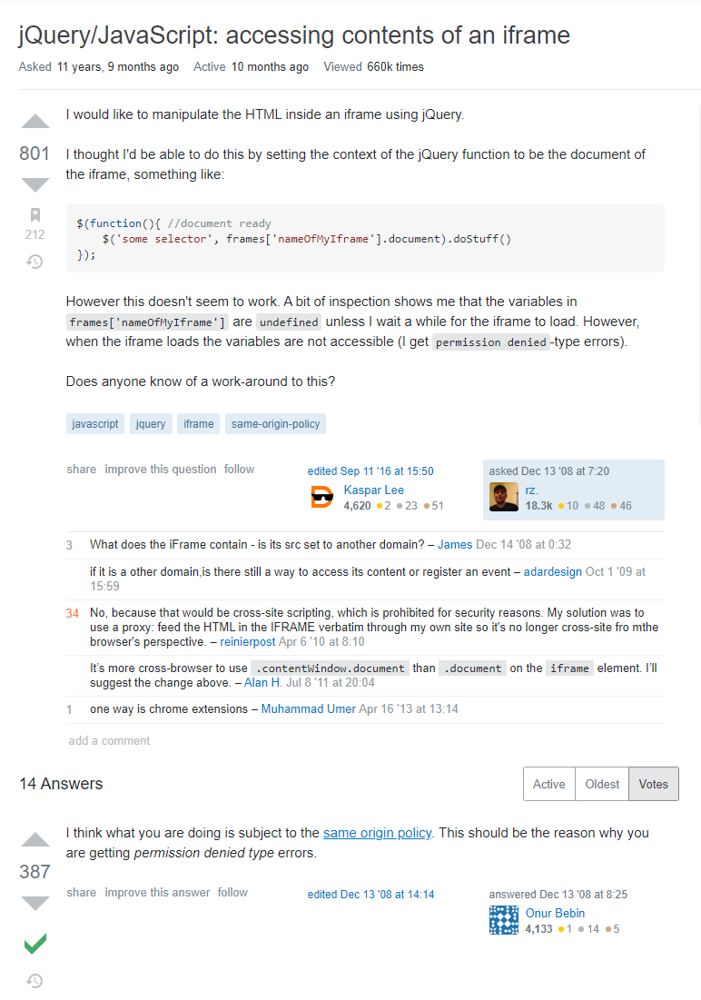

## What Is A Smart Question?

When in need of looking for a solution to your suffering of errors in programming, you would ask others for help and that's what Stack Overflow is there for. Simply just asking for help may not get you the answer that you were seeking for and that's because the way to asked and presented the question to the world of programmers willing to help. But what's the difference between a "smart" question vs to a "not smart" question. Well if you look at [How to Ask Questions The Smart Way](http://www.catb.org/esr/faqs/smart-questions.html) by Eric Raymond, he discusses the key differences between asking someone a smart question vs dumb questions. Like have you done x, y, z before and still have no luck solving your problem, was it clear what was your problem, were the headers part of the problem. Those types of things that you put in the your questions are way more likely to have it answered and even more correctly, even a simple greeting and thank you can come a long way of someone answering your question that you've been struggling on for the past 6 hours. Now lets look at some differences between what "smart" and "not smart" questions look like.

## Smart vs. Not Smart

 
Looking at this [smart question](https://stackoverflow.com/questions/364952/jquery-javascript-accessing-contents-of-an-iframe), the one posting the question clearly states what kind of language/program that they are currently having trouble with in the header so it lets anyone who is proficient in the language can help more easily. After he goes into more detail on what they needed and even showed their code to let people know that it was worked on. Then later states what the output was and if there were any errors so people answering don't need to recreate the problem and have a different answer. But there are way's to make this question even better than is. Maybe a simple "thank you" and "hello" with a bit clearer formatting that can go a long way but there are alot of good people willing to help others in need.

Now here are two exmaples of "not smart" questions on Stack Overflow, looking at the first picture there were many problems when this person was asking a question. First was the header being not clear and grammatical. You can tell that English is not their first language by the code they provided have comments not in English but ignore the fact of mentioning that they may not be good at it and there may be some errors in spelling. Another big problem in this question is that they wanted other people to do their work when they have never tried and figure out some sort of solutions themselves which is a big turn off to programmers on Stack Overflow. 

  
  

Also not explaining the code and what you clearly want is very vague and could mean anything to programmers. On the next "not smart" question, there are similarities between this question and the previous where the header is not explaining and just saying "Phython Help Again". Many of the users on Stack Overflow have commented on the question saying that ther person have never tried and didn't meet their expectations. Having showing code that does not work at all with the person claiming it works is also another red flag. 

When comparing both the "smart" and "not smart" questions, it's very clear how simply changing the way you ask can mean a difference on the answer you receive and the quality of it. Stack Overflow also have a FAQ on how to post questions properly just like Eric Raymond page explaining what you can do for your questions. Knowing how to make my questions "smart" can help me in the future when I would run into complex problems where after troubleshooting still run into issues.
 
