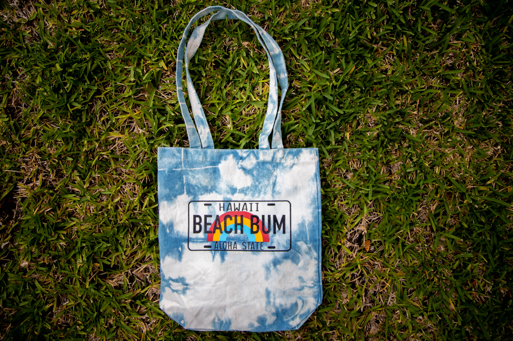
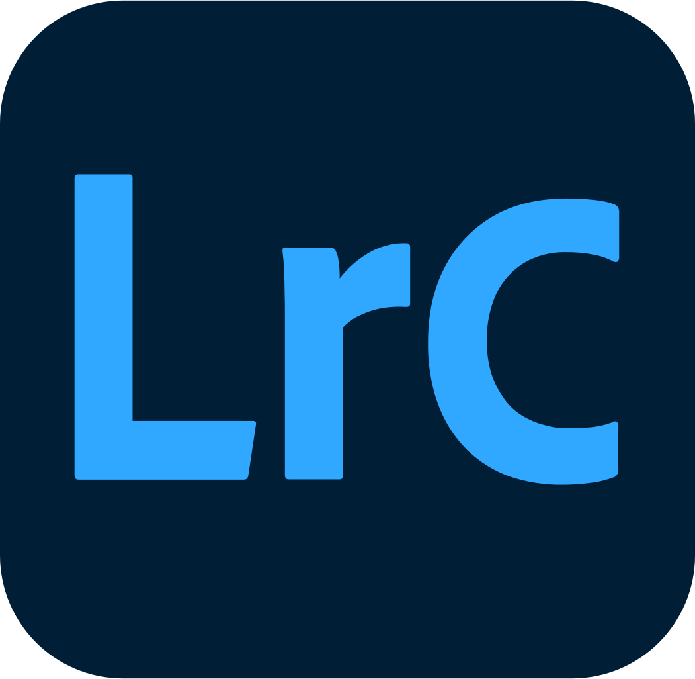

 

As my sister had started getting a new hobby over the summer of creating products, I was asked to help her by taking photos of her products to sell. Although, product photography isn't my best suit compared to doing portrait photography but nonetheless I agreed for me to practice as a personal project. Since there was no photos for me given to edit I was tasked to go out and take different types of shots which led me to ask how she wants the final product to look like. With the information given, I took as much raw pictures for me to have variety to give multiple options for what pictures to put on the product page. I then used Lightroom to helps me import, organize, manage, and find my images. Changing the basic modules, tone curves, HSL sliders, etc were all used to add life to the photo. Once finished, I transferred the photo into Photoshop to the fine-tune any blemishes thats present. After finishing, I gave my sister multiple variations of the same photo to pick out which one she liked and the picture above is one of the photos displayed on the product page. Even though that I don't do product photography, it was a fun project to do to help build my skills.

You can order from our link [Salty Beaches](https://rb.gy/lpfndm).
