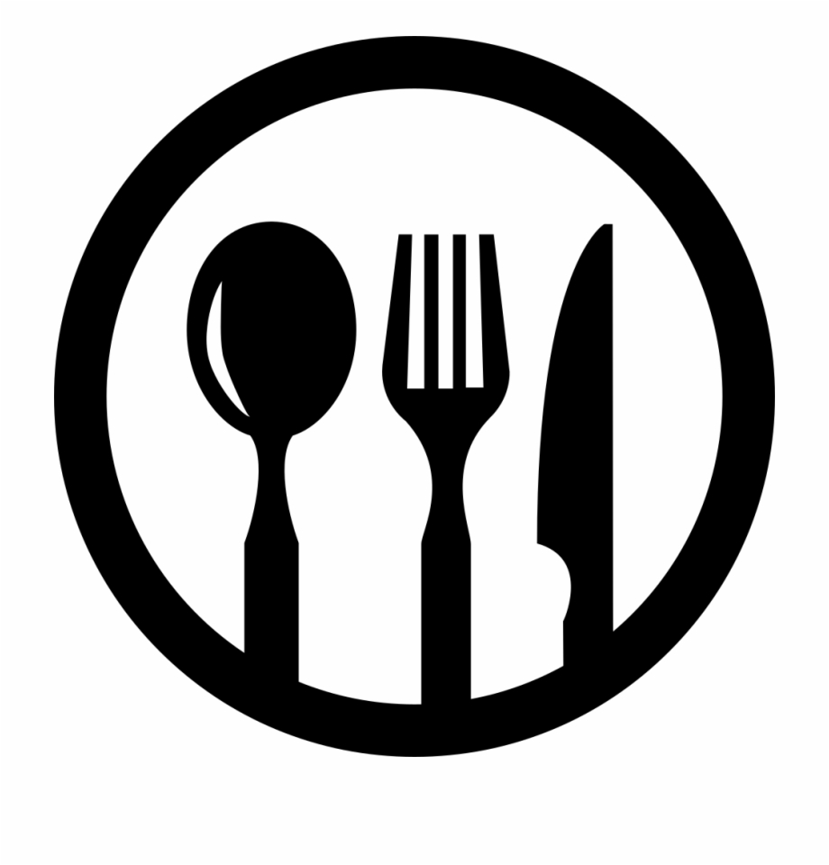

 

Kaiseki, often known as a traditional multi-course Japanese dinner is what we serve at a restaurant called Nanzan GiroGiro. While servers and chefs jobs are to take the customer orders and make the food and help run the operation smoothly, we strive for above and beyond by interacting with every customer as the layout of the restaurant is a open-bar. Because of this, our customers would feel relaxed knowing that they are getting their moneys worth. 
 
 

