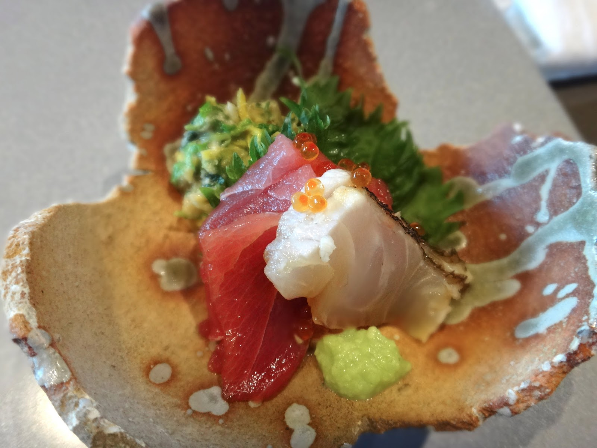

 
 
 
Kaiseki, often known as a traditional multi-course Japanese dinner is what we serve at a restaurant called Nanzan GiroGiro. While servers and chefs jobs are to take the customer orders and make the food and help run the operation smoothly, we strive for above and beyond by interacting with every customer as the layout of the restaurant is a open-bar. Because of this, our customers would feel relaxed knowing that they are going to have a good time. Learning about every customer allows us to adapt the next time they come and visit the restaurant making their experience even better than last time. There's even benefits for this style of serving like improved customer satisfaction, employee motivation, and operational procedures. No one likes it when the mood is all sour because of something went wrong, but making conversations to listen to the customers improves are support as we can adapt to their liking which is key to making a businesses sucessful. It's great to be part of this team for learning about our customers fun stories and I hope they can come back again 

 

